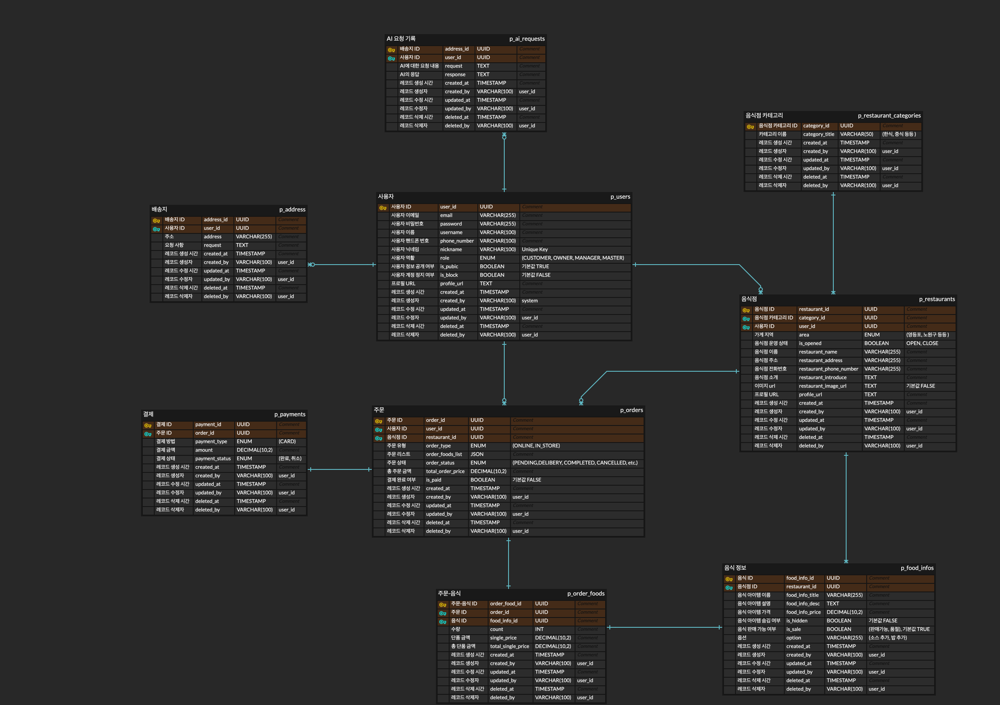
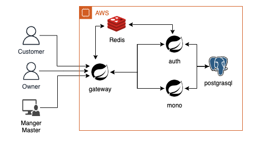
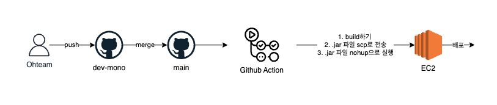
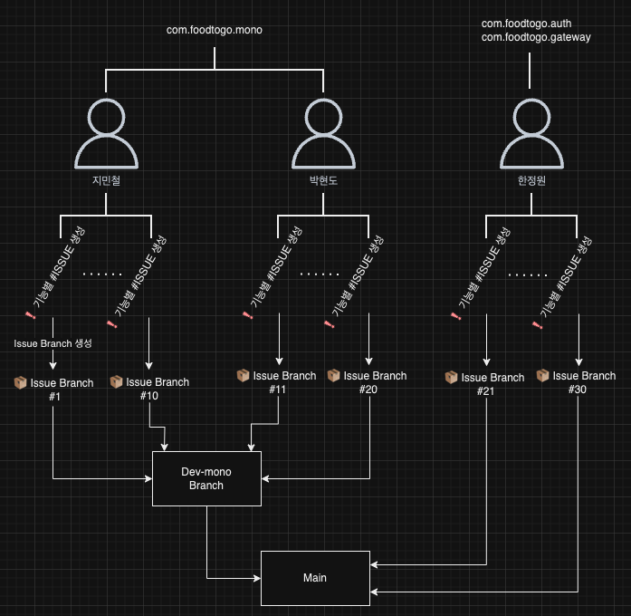

# 🍱 Project_FoodToGoWeb 🍱
주문 배달 플랫폼을 스프링 부트 기반의 API Gateway, Auth, Monolitic 3개의 서버로 개발한 팀프로젝트 입니다.

## 🗓️ 개발 기간
* 2024.08.22 ~ 2024.09.03
* [Github Projects Todo 링크](https://github.com/users/jiminchur/projects/4/views/1)
  
## 📚 목차
[1. 프로젝트 개요](#1-프로젝트-개요)

[2. 팀원 역할 분담](#2-팀원-역할-분담)

[3. 요구사항 명세서](#3-요구사항-명세서)

[4. API 명세서](#4-api-명세서)

[5. 테이블 설계서](#5-테이블-설계서)

[6. ERD](#6-erd)

[7. 기술 스택](#7-기술-스택)

[8. 인프라 설계도](#8-인프라-설계도)

[9. CICD 파이프라인](#9-cicd-파이프라인)

[10. Git Branch 및 Git Commit 전략](#10-git-branch-및-git-commit-전략)

[11. 시연영상](#11-시연영상)

[12. 4L 회고](#12-4L-회고)

## ✅ 1. 프로젝트 개요
* **주제:** 배달 및 포장 음식 주문 관리 플랫폼 개발
* **목표:** 광화문 근처에서 운영될 음식점들의 배달 및 포장 주문 관리, 결제, 그리고 주문 내역 관리 기능을 제공하는 플랫폼 개발

## 👬🏻 2. 팀원 역할 분담

### 🙌🏻 회의 기록

* [🗓️ [회의] 일자별로 회의 내용를 기록한 내용입니다. #1](https://github.com/jiminchur/Project_FoodToGoWeb/issues/1)
* [📘 Wiki - OurRules](https://github.com/jiminchur/Project_FoodToGoWeb/wiki/OurRules)

### 🫡 팀원 소개
|팀장(백엔드)|팀원(백엔드)|팀원(백엔드)|
|-----|-----|-----|
||||
|[지민철](https://github.com/jiminchur)|[박현도](https://github.com/atto08)|[한정원](https://github.com/dev-wonny)|

### 👊🏻 역할 분담

    
<h2>🙎🏻‍♂️ 지민철</h2>

    
🏠 가게

* [🏠 [가게 앱] 성능 개선 #115](https://github.com/jiminchur/Project_FoodToGoWeb/issues/115)

* [🏠 [가게 앱] 가게 운영 상태 변경 #12](https://github.com/jiminchur/Project_FoodToGoWeb/issues/12)

* [🏠 [가게 앱] 가게 검색 #11](https://github.com/jiminchur/Project_FoodToGoWeb/issues/11)

* [🏠 [가게 앱] 가게 삭제 #10](https://github.com/jiminchur/Project_FoodToGoWeb/issues/10)

* [🏠 [가게 앱] 가게 정보 전체 수정 #9](https://github.com/jiminchur/Project_FoodToGoWeb/issues/9)

* [🏠 [가게 앱] 가게 전체 조회 #8](https://github.com/jiminchur/Project_FoodToGoWeb/issues/8)

* [🏠 [가게 앱] 가게 단건 조회 #7](https://github.com/jiminchur/Project_FoodToGoWeb/issues/7)

* [🏠 [가게 앱] 가게 등록 #6](https://github.com/jiminchur/Project_FoodToGoWeb/issues/6)

    
    

    
📚 가게 - 카테고리

* [📚 [가게 - 카테고리] 성능 개선 #122](https://github.com/jiminchur/Project_FoodToGoWeb/issues/122)

* [📚 [가게 - 카테고리] 카테고리 삭제 #56](https://github.com/jiminchur/Project_FoodToGoWeb/issues/56)

* [📚 [가게 - 카테고리] 카테고리 수정 #55](https://github.com/jiminchur/Project_FoodToGoWeb/issues/55)

* [📚 [가게 - 카테고리] 카테고리 목록 조회 #54](https://github.com/jiminchur/Project_FoodToGoWeb/issues/54)

* [📚 [가게 - 카테고리] 카테고리 등록 #53](https://github.com/jiminchur/Project_FoodToGoWeb/issues/53)

    
🍱 음식

* [🍱 [[음식 앱] 성능 개선 #134](https://github.com/jiminchur/Project_FoodToGoWeb/issues/134)

* [🍱 [음식 앱] 음식 품절 처리 #91](https://github.com/jiminchur/Project_FoodToGoWeb/issues/91)

* [🍱 [음식 앱] 음식 삭제 #77](https://github.com/jiminchur/Project_FoodToGoWeb/issues/77)

* [🍱 [음식 앱] 음식 숨김 처리 #76](https://github.com/jiminchur/Project_FoodToGoWeb/issues/76)

* [🍱 [음식 앱] 음식 상세 정보 수정 #75](https://github.com/jiminchur/Project_FoodToGoWeb/issues/75)

* [🍱 [음식 앱] 음식 단건 조회 (운영진) #74](https://github.com/jiminchur/Project_FoodToGoWeb/issues/74)

* [🍱 [음식 앱] 음식 전체 조회 (운영진) #73](https://github.com/jiminchur/Project_FoodToGoWeb/issues/73)

* [🍱 [음식 앱] 가게에 속한 음식 조건 검색 #72](https://github.com/jiminchur/Project_FoodToGoWeb/issues/72)

* [🍱 [음식 앱] 가게에 속한 음식 전체 조회 #70](https://github.com/jiminchur/Project_FoodToGoWeb/issues/70)

* [🍱 [음식 앱] 가게에 속한 음식 등록 #69](https://github.com/jiminchur/Project_FoodToGoWeb/issues/69)

    
🤖 AI

* [[🤖 AI] ai 기록조회 #148](https://github.com/jiminchur/Project_FoodToGoWeb/issues/148)

* [[🤖 AI] ai 요청 및 데이터베이스에 저장 #132](https://github.com/jiminchur/Project_FoodToGoWeb/issues/132)

    
🛠️ CICD

* [🛠️ [CICD] Docker hub을 이용한 CICD 구축 #167](https://github.com/jiminchur/Project_FoodToGoWeb/issues/167)

* [🛠️ [CICD] Docker hub을 이용한 CICD 구축시 Redis와의 연결 오류 #168](https://github.com/jiminchur/Project_FoodToGoWeb/issues/168)

* [🛠️ [CICD] SCP를 이용한 CICD 구축 #169](https://github.com/jiminchur/Project_FoodToGoWeb/issues/169)

    
<h2>🧑🏻‍💻 박현도</h2>

    
결제

* [[Payment] 초기 구현 #146](https://github.com/jiminchur/Project_FoodToGoWeb/issues/146)

    
배송지

* [[Address] 회원 배송지 삭제 #62](https://github.com/jiminchur/Project_FoodToGoWeb/issues/62)

* [[Address] 회원 배송지 수정 #61](https://github.com/jiminchur/Project_FoodToGoWeb/issues/61)

* [[Address] 회원 배송지 목록 조회 #60](https://github.com/jiminchur/Project_FoodToGoWeb/issues/60)

* [[Address] 회원 배송지 상세 조회 #59](https://github.com/jiminchur/Project_FoodToGoWeb/issues/59)

* [[Address] 회원 배송지 등록 #58](https://github.com/jiminchur/Project_FoodToGoWeb/issues/58)

    
주문

* [[Order] totalOrderPrice @Enumerated 설정 제거 [Payment] PaymentRequestDto amount 제거 #155](https://github.com/jiminchur/Project_FoodToGoWeb/issues/155)

* [[Order] 성능 개선 #126](https://github.com/jiminchur/Project_FoodToGoWeb/issues/126)

* [[Order] 주문 내역 삭제 #99](https://github.com/jiminchur/Project_FoodToGoWeb/issues/99)

* [[Order] 주문 내역 목록 조회 - [고객, 가게, 운영진] #96](https://github.com/jiminchur/Project_FoodToGoWeb/issues/96)

* [[Order] 주문 단건 조회 #95](https://github.com/jiminchur/Project_FoodToGoWeb/issues/95)

* [[Order] 주문 취소 요청 #94](https://github.com/jiminchur/Project_FoodToGoWeb/issues/94)

* [[Order] 주문 상태 변경 #93](https://github.com/jiminchur/Project_FoodToGoWeb/issues/93)

* [[Order] 주문 등록 #92](https://github.com/jiminchur/Project_FoodToGoWeb/issues/92)

    
유저

* [[Users] 성능 개선 #125](https://github.com/jiminchur/Project_FoodToGoWeb/issues/125)

* [[Users] 회원 전체 조회 - 관리자 #18](https://github.com/jiminchur/Project_FoodToGoWeb/issues/18)

* [[Users] 회원 검색 - 관리자 #17](https://github.com/jiminchur/Project_FoodToGoWeb/issues/17)

* [[Users] 회원 삭제 #16](https://github.com/jiminchur/Project_FoodToGoWeb/issues/16)

* [[Users] 회원 정보 수정 #15](https://github.com/jiminchur/Project_FoodToGoWeb/issues/15)

* [[Users] 회원 정보 조회 #14](https://github.com/jiminchur/Project_FoodToGoWeb/issues/14)

* [[Users] 회원 전체 조회 #13](https://github.com/jiminchur/Project_FoodToGoWeb/issues/13)

    
<h2>👩🏻‍💻 한정원</h2>

    
🚪 Gateway

* [[gateway] 초기 세팅 #19](https://github.com/jiminchur/Project_FoodToGoWeb/issues/19)

* [[gateway] 필터 개선 #131](https://github.com/jiminchur/Project_FoodToGoWeb/issues/131)

* [[gateway] 인증, 모노리티 서버 호출 연동 #145](https://github.com/jiminchur/Project_FoodToGoWeb/issues/145)

    
🔐 Auth

* [[인증 서버] 초기 세팅 #20](https://github.com/jiminchur/Project_FoodToGoWeb/issues/20)

* [[인증 서버] jwt - 발급 #21](https://github.com/jiminchur/Project_FoodToGoWeb/issues/21)

* [[인증 서버] jwt - 토큰 검증 #22](https://github.com/jiminchur/Project_FoodToGoWeb/issues/22)

* [[인증 서버] jwt - 재발급 #23](https://github.com/jiminchur/Project_FoodToGoWeb/issues/23)

* [[인증 서버] user - 등록 #24](https://github.com/jiminchur/Project_FoodToGoWeb/issues/24)

* [[인증 서버] user - 수정 #25](https://github.com/jiminchur/Project_FoodToGoWeb/issues/25)

* [[인증 서버] user - 조회 #26](https://github.com/jiminchur/Project_FoodToGoWeb/issues/26)

* [[인증 서버] user - 삭제 #27](https://github.com/jiminchur/Project_FoodToGoWeb/issues/27)

* [[인증 서버] user - 로그인 #28](https://github.com/jiminchur/Project_FoodToGoWeb/issues/28)

* [[인증 서버] user - 로그아웃 #29](https://github.com/jiminchur/Project_FoodToGoWeb/issues/29)

* [[인증 서버] redis - 캐시 조회, 갱신 #30](https://github.com/jiminchur/Project_FoodToGoWeb/issues/30)

* [[인증 서버] redis - 캐시 업데이트 #31](https://github.com/jiminchur/Project_FoodToGoWeb/issues/31)

* [[인증 서버] redis - 캐시 삭제 #32](https://github.com/jiminchur/Project_FoodToGoWeb/issues/32)

* [[인증 서버] 비밀번호 - 변경 #34](https://github.com/jiminchur/Project_FoodToGoWeb/issues/34)

* [[인증 서버] gateway서버에서 인증서버 기능 호출 시 맞지 않는 부분 수정 #128](https://github.com/jiminchur/Project_FoodToGoWeb/issues/128)

    
👦🏻 유저

* [[유저 앱] 레디스 권한 체크 추가 #159](https://github.com/jiminchur/Project_FoodToGoWeb/issues/159)

* [[gateway] 인증, 모노리티 서버 호출 연동 #145](https://github.com/jiminchur/Project_FoodToGoWeb/issues/145)

* [[모노리틱 서버] 검색DTO 공통화 #170](https://github.com/jiminchur/Project_FoodToGoWeb/issues/170)

## 📕 3. 요구사항 명세서
* Wiki에 따로 요구사항 명세서를 기록하였습니다.
* [📘 Wiki - 요구사항 명세서 링크](https://github.com/jiminchur/Project_FoodToGoWeb/wiki/%EC%9A%94%EA%B5%AC%EC%82%AC%ED%95%AD-%EB%AA%85%EC%84%B8%EC%84%9C)

## 📙 4. API 명세서
* API 명세서에 설계에 따라 개발을 하였고, 첫 설계와 다른점이 있다고 생각하면 [🛠️ [수정사항] API 명세서 수정사항 #90](https://github.com/jiminchur/Project_FoodToGoWeb/issues/90)에 기록하였습니다.
* 아래 Notion 링크를 통해서 확인 가능합니다.
* [Ohteam - API 명세서 - Notion](https://mire-plastic-701.notion.site/333fba57922143e39638d69ab7b9890b?v=19dba6a601034c9fa0da7acbf82b059e&pvs=4)

## 📄 5. 테이블 설계서
* 요구사항 명세서의 **데이터 베이스 설계**의 규칙에 따라 작성하였습니다.
* 아래 Notion 링크를 통해서 확인 가능합니다.
* [Ohteam - 테이블 설계서 - Notion](https://mire-plastic-701.notion.site/7f5926ee36a84122ab90c34951d68f39?pvs=4)

## 📋 6. ERD

* 테이블 설계서에 따라 만든 ERD입니다.

## 🛠️ 7. 기술 스택
* Backend
    * Spring Boot 3.3.3
    * Spring Cloud Gateway
    * Gradle
    * JWT
    * Oauth2
    * QueryDSL
    * JPA
* API Test
    * PostMan
* Database
    * Postgresql
    * Redis
* Infra
    * AWS EC2 t2.medium
    * Docker
* CI/CD
    * GitAction
* Communication
    * Slack
* Version
    * Git
    * Github

## 🛠️ 8. 인프라 설계도

## 🔨 9. CICD 파이프라인

* [🛠️ [CICD] Docker hub을 이용한 CICD 구축 #167](https://github.com/jiminchur/Project_FoodToGoWeb/issues/167)

* [🛠️ [CICD] Docker hub을 이용한 CICD 구축시 Redis와의 연결 오류 #168](https://github.com/jiminchur/Project_FoodToGoWeb/issues/168)

* [🛠️ [CICD] SCP를 이용한 CICD 구축 #169](https://github.com/jiminchur/Project_FoodToGoWeb/issues/169) - ✅ 저희가 적용한 방법입니다.

## 📀 10. Git Branch 및 Git Commit 전략

* Git Branch 전략
    * 자세한 내용은 [📘 Wiki - GitBranch 전략 링크](https://github.com/jiminchur/Project_FoodToGoWeb/wiki/Git-Branch-%EC%A0%84%EB%9E%B5) 에서 확인 가능합니다.

* Git Commit 전략
    * 자세한 내용은 [📘 Wiki - GitCommit 전략 링크](https://github.com/jiminchur/Project_FoodToGoWeb/wiki/Commit-%EC%A0%84%EB%9E%B5) 에서 확인 가능합니다.

|머리말|내용|
|-----|-----|
|Init|시작|
|Fix|버그 수정|
|Add|새로운 기능 추가|
|Update|기존 기능 업데이트|
|Remove|불필요한 코드 제거|
|Refactor|코드 리팩토링|
|Improve|성능 개선|
|Document|문서화|
|Style|스타일 변경 (예: 코드 포맷팅)|
|Test|테스트 추가 또는 수정|

## 🎥 11. 시연영상
* [ ▶ 시연영상 YouTube 링크](https://youtu.be/dwh8I9PK0ec)
* 로그인 부터 주문,가게 등록, 등등 저희가 작업했던 내용들을 Http test를 통해 시연한 영상입니다.

## 🤓 12. 4L 회고
* 4L 이란??
  > Liked : 좋았던 것/잘 한 것, Lacked : 아쉬웠던 것/부족했던 것, Learned : 배운 것, Longed for : 바라는 것/개선을 위해 시도해볼 것을 작성해보면서 프로젝트를 회고하는 방법입니다.

    
<h2>🙎🏻‍♂️ 지민철</h2>

### 1. Liked : 좋았던 것/잘 한 것
* Git Branch 전략 및 Git Commit Convention 에 따라 Github을 사용해서 잘 협업한것
* 처음에 설계한 Gateway , Auth , Mono 서버를 분리하여서 서비스를 개발한것
* CICD를 구축해서 Main Branch에 Push 하면 자동적으로 수정해서 배포가 된것
* 회의를 통해서 개발방식을 최대한 비슷하게하여 코드의 통일성을 유지한 것
* 클린코드를 우선시하고 중복된 코드를 최소한으로 줄인점
* 최선의 방법은 아니지만 차선의 방법으로라도 기능구현을 완료한것
* 서로의 의견을 존중하고 수용하며 최대한 맞춰서 개발한점
* 기간내에 완료한점
  
### 2. Lacked : 아쉬웠던 것/부족했던 것
* 기능 구현에 우선시가 되어있고, 시간관계상 코드의 퀄리티에 신경을 제대로 쓰지 못한점
* 코드리뷰시간을 많이 갖질 못해서 초반에 코드 통일화에 대한 부족함
* 처음에 설계했던 모든 서비스를 도커를 띄우지 못한점 (Redis와 연결 이슈)
* 성능 개선을 더하지 못한점
* 코드의 중복사용을 더 막지 못한점
* 로그기록 남길때 Delete부분은 Auditing을 적용하지 못한점
* 막판에 Issue기록을 잘 못한점
* 시간이 부족해 더 많은 기능구현을 못한점

### 3. Learned : 배운 것
* Jpa Auditing으로 Create, update를 자동적으로 생성할 수 있는점
* Entity에서는 Dto의 존재를 몰라야 한다는 점
* Redis redis.conf에서 설정을 할 수 있다는 점
* Spring Cloud에서 Eureka 서버가 필수는 아니라는 점
* Enum을 사용시 데이터 베이스에 여러가지 타입으로 저장이 가능하다는 점
* 로그아웃시 블랙리스트 토큰으로 재로그인을 하게해서 토큰 재발급을 유도한다는 점

### 4. Longed for : 바라는 것/개선을 위해 시도해볼 것
* Redis를 Docker로 띄울때 Docker로 띄운 웹서비스와의 통신
* 검색을 할때 여러가지 필터를 적용을 해보기
* 로그기록에서 Delete부분까지 Jpa Auditing을 적용해서 자동으로 기록해주게 하기

    
<h2>🧑🏻‍💻 박현도</h2>

### 1. Liked : 좋았던 것/잘 한 것
* MSA구조로 인증, 인가, 기타 서비스를 구분한 점
* Git Flow 전략
  
### 2. Lacked : 아쉬웠던 것/부족했던 것
* 코드 공통화를 진행하지 못한 점
    * 각자 맡은 서비스를 개발 후 시간이 부족
* 의사소통이 부족함
    * 개발 요구사항을 보고 내가 이해한대로 모두 이해했을거라 생각함
    * 잘못된 방향으로 개발 진행 - 시간소비
* 스스로 강의를 통해 학습한 부분을 적용하지 못한점
    * 시간 부족으로 Redis적용을 하지 못함
* 접근하려는 데이터에 대한 사용자의 유효성 검사 여부
    * 어디까지 검사하고 어디까지 생략해도 되는지 기준점을 세우지 못함
* 쿼리문 남발 안하기
    * 언제 필요하고 언제 필요없는지 명확히 구분짓지 못함
    * 하나의 api안에 진짜 필요한 경우만 사용하려 노력했지만 과연 정말 필요한 경우만 사용한건지는 잘 모르겠음
  
### 3. Learned : 배운 것
* Entity에 Setter를 사용 & DTO 괄련 내용 사용 하면 안됨
    * 엔티티 클래스는 비즈니스 로직과 데이터베이스와의 상호작용을 담당
    * DTO는 데이터 전송을 위한 별도의 클래스로 유지하는 것
    * 이러한 설계는 코드의 가독성, 유지보수성, 유연성, 보안성을 향상시킨다.
* Spring Webflux & Spring Web 차이
    * 존재를 Spring web과 webflux에 대해 알게됨
    * web 동기 처리 방식 & webflux 비동기 처리 방식
* 프로젝트 Authorization 검증시 User-Id , Role 값이 헤더에 담겨오는 이유와 과정
    * Filter단에서 HttpHeader에 전송전 값을 삽입해 줬음
* Spring Cloud를 사용한 MSA구조 설계 시 Eureka Server가 필수가 아니다
    * 헬스 체크하는 기능이 탑재된 장점
    * 하지만 라우팅 하는것은 Gateway 쪽이기 떄문에 Gateway쪽에서 사용하려는 나머지 서비스들을 등록하기만 하면 사용 가능
* CICD시 application.yml에 관련된 정보를 암호화 사용법
    * application.yml 자체를 Github Sercrets에 올려서 사용하는 방법도 있었음
* Enum 사용시 타입별 저장 방법의 존재
    * EnumType Ordinal, String 각자 장단점이 존재
* Dto 사용시 Record 타입 사용
    * 불변 객체 : Record로 정의된 객체는 기본적으로 불변 & 상속 불가 & 기본적으로 Getter 탑재 Setter는 불변 객체이기에 X
      
### 4. Longed for : 바라는 것/개선을 위해 시도해볼 것
* Spring Seurity를 사용한 인증 인가 처리
    * 권한 체크로직을 효율적으로 관리하는 방향으로 리팩토링
* 모놀리식 서비스를 Redis 사용
    * 배운 레디스 캐시를 적용하지 못한 아쉬움
* 서비스 배포 시 Docker 사용법 학습
    * 실제로 배포하는 과정에서 Docker를 통한 내부통신에 대한 추가학습 필요 - 네트워크
      

    
<h2>👩🏻‍💻 한정원</h2>

### 1. Liked : 좋았던 것/잘 한 것
* 설계대로 서버를 구성한것
  
### 2. Lacked : 아쉬웠던 것/부족했던 것
* 서버가 어떤 역할을 해야하는지 생각하는 시간을 갖음
    * 게이트 웨이는 라우팅
    * 인증서버는 인증/인가
    * 현재는 게이트웨이 서버에서 JWT 검증 수행
    * 인가를 하고 있다. (유저에 대한 권한을 허락하는 것)

* JWT를 다룬것
    * JWT인증에 대해서 이론만 알고 실습을 해보지 않았는데 만들면서 이해가 높아졌다.
    * 로그아웃을 만들면서 Redis로 블랙리스트를 추가해본것

* 작동됨 & 배포
    * 기능이 작동됨
    * 실제로 한 바퀴 Http Test가 가능한점

### 3. Learned : 배운 것
* 코드 개선 시간이 부족함
    * 학습을 토대로 서버를 만들다보니, 빠르게 만들지 못한 것이 아쉬움
    * 팀원이 만든 코드를 공통화, 추상화로 작업할 시간이 부족

* 로그 필요성
    * 서버를 배포하고 나서 서버를 만든 사람만 로그를 보는게 가능
    * 어디서 오류가 나고 있는지 보지 못한는 것이 답답
    * 처음 설계할 때부터 로그를 볼 수 있는 환경 필요성 느낌
      
### 4. Longed for : 바라는 것/개선을 위해 시도해볼 것

